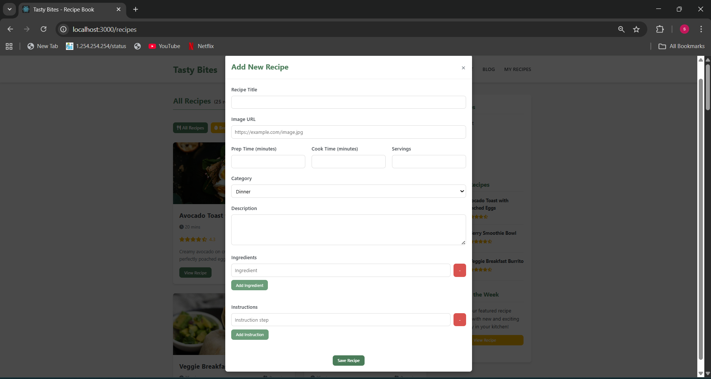

# Recipe Book

**Recipe Book** is a web application built using **React** as part of a university project. The platform allows users to:

- Explore a collection of recipes, food facts, and quick cooking tips.
- Share their own cooking tips and recipe reviews.
- Interact with a community of food enthusiasts.

## Features

- **Community Snippets**: Quick tips, facts, and recipe reviews.
- **Recipe Reviews**: Users can read and share feedback on recipes.
- **Responsive Design**: Clean and mobile-friendly interface.
- **Sidebar Overview**: Highlights top contributors and community stats.

## Tech Stack

- **Frontend**: React.js
- **Styling**: CSS (with custom styles)
- **State Management**: React Hooks
- **Routing**: React Router
- **Deployment Ready**: Can be hosted on GitHub Pages or any static server.

## Team

Developed by a team of university students as part of our course learning:

- Ravuri Sai Srilekha
- Shashumna Nivas
- Sheelam Divya

## Results / Screenshots

  
  

  
  

  
  

## React Topics Covered

- Functional Components & JSX
- Props and State Management
- useState & useEffect Hooks
- Conditional Rendering
- Event Handling and Forms
- Routing (React Router)
- Modular and Reusable Components

## Usage

1. Clone the repository
2. Run `npm install` to install dependencies
3. Run `npm start` to start the local development server

## License

This project is for educational purposes.
